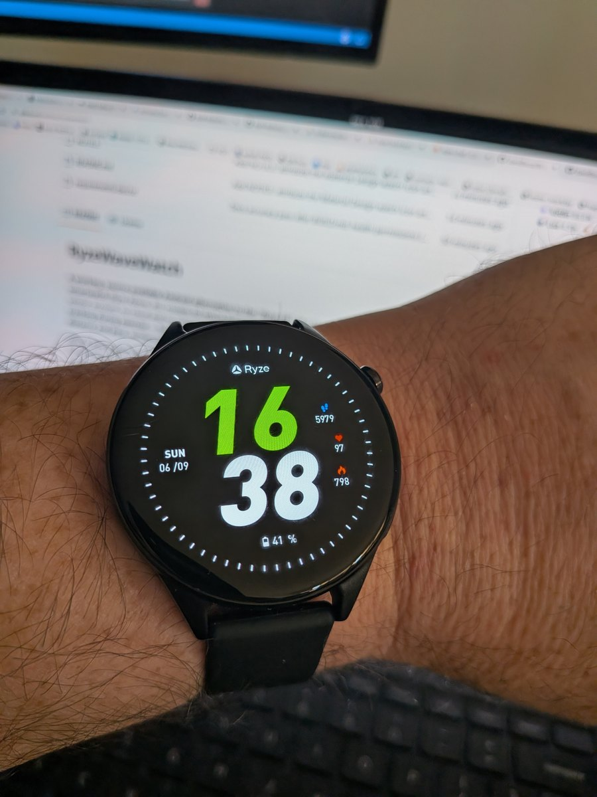
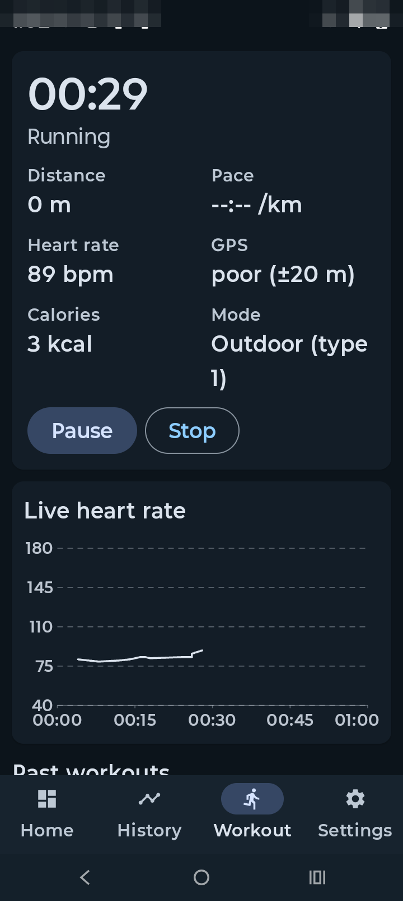
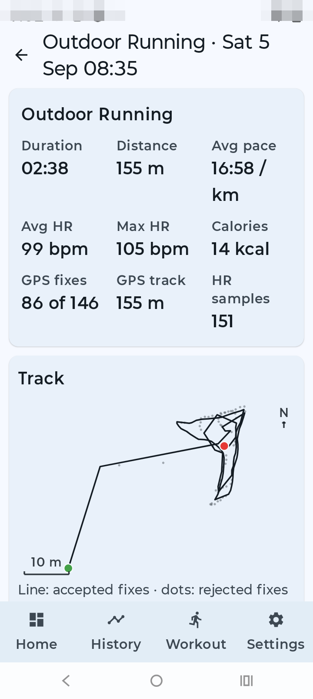
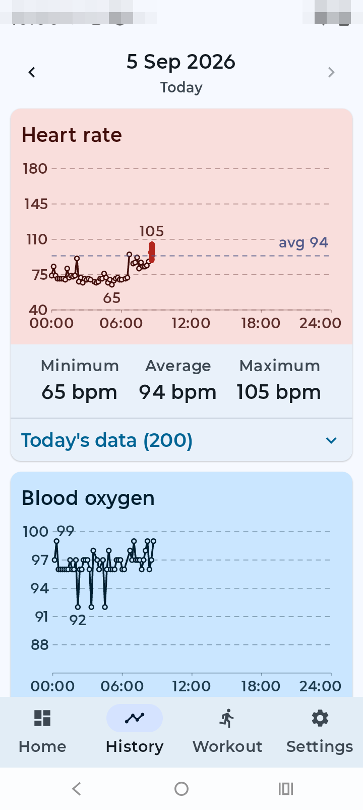
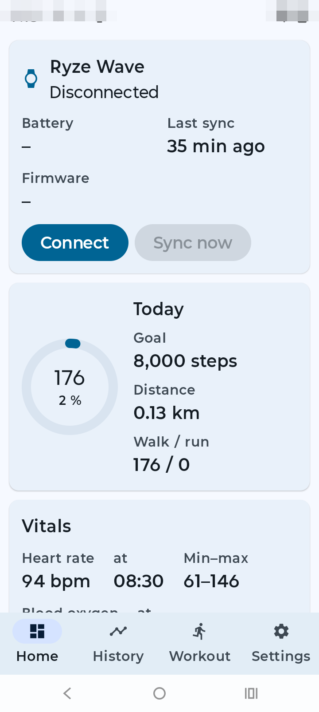

# RyzeWaveWatch

**A working, source-available Android alternative to the "Ryze Fit" app that ships with the Ryze Wave smartwatch**
(Ryze Above, AU; models RZ-WADA/B/C). It talks to the watch directly over Bluetooth LE with no vendor account, no
cloud and no telemetry, and it is built around the thing the vendor app does worst: **live tracking during
exercise — heart rate every second, blood oxygen, and a real GPS track with honest distance and pace**, written
straight into Android Health Connect so the data is yours.

What it does today: connects and syncs steps, heart rate, SpO2 and sleep; starts, pauses and stops a workout from
either the phone or the watch, with spoken cues; streams live heart rate while you run; records the GPS track on
the phone and reports distance and pace from it, falling back to a step-and-stride estimate when GPS is lost;
recognises all 70 of the watch's sport types; forwards phone notifications to the watch; rings the phone from the
watch; and exports everything to Health Connect.

| The watch | Live workout | GPS track and summary | Heart rate and SpO2 | Dashboard |
|---|---|---|---|---|
|  |  |  |  |  |

The photo and screenshots are from real use; image metadata is stripped, personal details are pixelated and
every GPS coordinate in this repo is deliberately displaced (see [docs/privacy_audit_20260906.md](docs/privacy_audit_20260906.md)).

## Things this app does that the vendor app does not

1. **It stops you starting a run with GPS switched off.** Forgetting location services is easy and it silently
   ruins the whole session, so the Workout screen refuses to start one: the Start button is replaced by a warning
   and a button that opens the location settings, and it re-checks when you come back. The vendor app shows a
   dismissible "turn on GPS" dialog and then happily records nothing.
2. **It notices a workout you started in your sleep.** Knocking the watch in bed can drop it into workout mode and
   leave it there all night. The app watches heart rate, motion, steps and GPS over a rolling window; if it is the
   small hours, your heart rate has sat at sleeping level and the phone has not moved, it warns and then ends the
   session on its own instead of logging a nine-hour "run".
3. **It knows what each sport should look like.** All 70 of the watch's sport types are grouped by the signals a
   genuine session produces, so "is this still happening?" is asked the right way per sport: outdoor running expects
   steps, GPS movement and raised heart rate; a spin bike or elliptical expects heart rate and motion but no GPS and
   no steps; yoga expects only that the phone moves with you; swimming and fishing are never judged at all. A sport
   whose signals cannot be measured is never flagged.
4. **It measures distance when the signal is poor.** The vendor app returned 0.0 km after a twenty-minute run.
   Ours accepts fixes up to 60 m accuracy and rejects jitter by radius rather than discarding whole fixes, which on
   the synthetic runs lands within a fraction of a percent when the phone reports Doppler speed and within a couple
   of percent without it. It also draws the rejected fixes on the track, so you can see what it decided.
5. **No blank pace for the whole run.** When GPS is unavailable or lost, pace and distance are computed from your
   steps and a calibrated stride and labelled "(est)", instead of showing nothing until the session ends.
6. **Stride is yours, not a formula.** Walking and running strides start from your height and can be overridden in
   Settings, and the two are tracked separately because the watch reports walking and running steps separately.
7. **Pause, resume and stop work from either end.** Press the button on the watch or in the app and both agree,
   with spoken cues so you do not have to look, and a session you start on the watch is announced and monitored. The
   watch's firmware sometimes floods pause and resume in bursts; the app waits 8 seconds for the state to settle
   instead of chopping your run into fragments.
8. **It cannot phone home.** The app requests no internet permission at all, so it is incapable of sending your data
   anywhere; everything lives in a plain SQLite file on your phone that you can copy off over adb (see
   [BUILD.md](BUILD.md#backing-up-and-restoring-your-data)). The vendor app requests internet access and talks to
   a dozen cloud endpoints.
9. **A "plan B" track that does not need the watch.** An opt-in background breadcrumb records where you went even
   when the watch drops the link mid-session, and a finished workout can be rebuilt from it afterwards. It keeps
   14 days and is off unless you turn it on.
10. **You can fix the sport afterwards.** Started an "outdoor run" that was really a bike ride? Override the type on
    the finished workout, and the export follows.
11. **It is auditable.** The protocol it speaks is written down in [docs/PROTOCOL.md](docs/PROTOCOL.md) and its
    behaviour in [docs/APP.md](docs/APP.md), so nothing it sends to your watch or writes to Health Connect is a
    black box.

Build it and put it on your phone: **[BUILD.md](BUILD.md)**. The app's design and behaviour: [docs/APP.md](docs/APP.md).

Not affiliated with, endorsed by, or supported by Ryze Above or the makers of the Ryze Fit app. "Ryze" and "Ryze
Wave" are their trademarks, used here only to say which watch this talks to. Use it at your own risk: it is not a
medical device and nothing it records should be treated as medical data.

**Licence:** copyright (c) 2026 David Buzz, all rights reserved, licensed to you under the
[PolyForm Noncommercial License 1.0.0](LICENSE). Use it, change it and share it freely for any **noncommercial**
purpose, including personal use, study and hobby projects. **Commercial use requires a separate written agreement**
and may require payment. This is source-available software, not open source. A few files come from
elsewhere under permissive licences and are listed in [NOTICE](NOTICE).

---

## If you want to hack on this app

The rest of this README is the reverse-engineering side: how the watch's protocol was worked out, the tools that
did it, and what is still unknown. None of it is needed just to build and run the app.

### What we know so far (2026-09-04)

| Item | Value |
|---|---|
| Watch BT name / MAC | `Ryze Wave(ID-91E5)` / `78:02:B7:37:91:E5` (OUI: ShenZhen Ultra Easy Technology) |
| Vendor app | Ryze Fit, Android package `com.yc.ryzefit` (v1.3.8), iOS id 6474378070 |
| Underlying SDK | UTE / Shenzhen Youhong "yc pedometer" SDK (`com.yc.pedometer.sdk`) — same family as GloryFit, DayDay Band, etc. |
| SoC | Realtek RTL8763-family (app bundles `com.realsil.sdk.dfu` + `libRtkAesJni.so`) |
| Radio | Bluetooth 5.2 dual-mode |
| Classic BT (BR/EDR) | HFP / A2DP / AVRCP / PBAP / SPP — audio, calling, answer/hang-up. Standard profiles, nothing to reverse. |
| BLE GATT | Custom services **0x55FF** (cmd: `33F1` write / `33F2` notify), **0x56FF** (data: `34F1` / `34F2`), **0x57FF** ("Alipay"/payments: `35F1` / `35F2`). All health data, notifications and settings go here. |
| Open-source reference | Gadgetbridge "GloryFit" driver (PR #5063) speaks the same protocol, but did **not** work with this watch out of the box. The `D5` password handshake was the first suspicion and turned out **not** to be required here (feature bitmap `FL1=0x4BA1D4`, password bit clear); the real gaps are the missing live-HR and SpO2 commands and the year-byte fix, listed in [docs/PLAN.md](docs/PLAN.md) and [docs/gadgetbridge_upstream.md](docs/gadgetbridge_upstream.md). |

The full command table, packet formats and the pairing handshake are in
[docs/PROTOCOL.md](docs/PROTOCOL.md).

### Layout

```
README.md, CLAUDE.md        this file / notes for Claude Code sessions
BUILD.md                    how to build the apps and install them on a phone
docs/PROTOCOL.md            BLE protocol reference (living document)
docs/gadgetbridge_upstream.md  Protocol corrections worth sending to the Gadgetbridge GloryFit driver
docs/PLAN.md                plan for the replacement app (platform, features, distance model, milestones)
docs/wave_application_research.md   narrative research notes: everything that mattered, tagged by how we know it
docs/watch_features_research.md     the watch's non-exercise features (voice, contacts, music, games, faces) and what we could do with them
docs/privacy_audit_20260906.md      what was scrubbed from this repo before publishing, and the rules that now apply
docs/sports_and_step_counting.md    all 70 sports: what the wrist sees in each, and whether its count means anything
memory/                     Claude Code's notes for this project (one fact per file, index in MEMORY.md)
ryzewave/                   our BLE client library + CLI (protocol.py = codec, client.py = bleak I/O)
ryzeapp/                    "Buzz's Ryze Wave": the real Android app (Kotlin/Compose/Room/Health Connect), spec in docs/APP.md
android/                    RyzeBridge: headless Android app (Java, no Gradle) that relays BLE <-> adb logcat
tools/bridge.py             drives RyzeBridge over adb and decodes the traffic (info, sync, hr, spo2, keep, raw)
tools/fastbuild.sh          incremental build + install of the app in seconds (see BUILD.md)
tools/make_signed_release.sh  signed release APK + source zip + checksums, optionally a GitHub release
tools/app_smoke.sh          build + install + launch + screenshot loop for the app (captures/app_smoke_<ts>/)
tools/pull_app_data.sh      pull the app's database and settings off a phone into captures/
tools/analyse_workout.py    summarise a pulled workout (distance, pace, HR, track)
tools/privacy_blur.py       pixelate regions of a screenshot before committing it (see docs/privacy_audit_20260906.md)
tools/app_tap.sh            tap a UI element on the phone by its text (uiautomator), e.g. tools/app_tap.sh "Sync now"
tools/app_workout_test.sh   scripted workout on the phone: start, wait, stop, capture FD traffic + screenshots
tests/                      offline codec tests
tools/probe.py              first-contact BLE client: connect, dump GATT, A1/A2
tools/linktest.py           60 s link-stability test with RSSI sampling (run in the background)
tools/logcat_capture.sh     record the phone's logcat (Ryze Fit prints every BLE packet in hex)
tools/parse_logcat.py       turn that log into a packet timeline
tools/pull_btsnoop.sh       pull the Android HCI snoop log via adb
tools/decode_btsnoop.py     print GloryFit ATT traffic from a btsnoop log
tools/extract_opcodes.py    regenerate captures/sdk_opcode_map.txt from the decompiled SDK
tools/Gadgetbridge/         sparse clone of Gadgetbridge (GloryFit/No1F1/JYou drivers only, git-ignored)
tools/Gadgetbridge-tools/   Gadgetbridge-tools clone, branch jr-gb-dissector (git-ignored)
tools/jadx/                 jadx 1.5.6 decompiler (git-ignored)
captures/                   btsnoop logs and derived notes (logs are git-ignored)
apk/                        Ryze Fit XAPK + jadx output (git-ignored, ~1 GB)
.venv/                      python venv (bleak, pytest, pillow)
```

### Getting started

Building the Android app and putting it on a phone: **[BUILD.md](BUILD.md)**. The rest of this section is the
Python client, which talks to the watch from the laptop.

```bash
python3 -m venv .venv && .venv/bin/pip install -r requirements-dev.txt
.venv/bin/python -m pytest tests            # offline codec tests
sudo tools/le_only.sh on                    # Linux/BlueZ: force the LE bearer (see docs/PROTOCOL.md §8); `off` restores dual mode
bluetoothctl trust 78:02:B7:37:91:E5        # once: lets BlueZ cache the (slow) GATT discovery
.venv/bin/python -m ryzewave info           # watch must NOT be connected to the phone (adb shell svc bluetooth disable)
.venv/bin/python -m ryzewave sync|hr|spo2|workout|time|find|scan|raw HEX
```
Pairing state is cached at runtime in `captures/devices.json`; it is not tracked and is not part of the repo.

### Phone as the BLE radio (RyzeBridge)

The laptop's Intel/BlueZ stack keeps dropping the LE link (supervision timeouts), while the phone's stack is
rock solid with this watch. `android/` is a tiny headless app that owns the GATT connection on the phone and is
driven entirely over adb, so all protocol work stays in Python:

```bash
android/sdk-install.sh          # once: cmdline-tools + platform 34 + build-tools 34 into tools/android-sdk (~300 MB)
android/build.sh                # aapt2 + javac + d8 + apksigner, then adb install + pm grant BLUETOOTH_* (details: BUILD.md)
tools/bridge.py info            # connect, feature bitmap, version, battery
tools/bridge.py sync|hr 30|spo2|workout 60|keep 120|gatt|bt3 on|spo2auto 10|hrauto on|raw "connect;write a2;until a2 3000"
adb logcat -s RyzeBridge:*      # raw view: TX/RX lines in hex
```
`tools/bridge.py` force-stops Ryze Fit before each run: Android shares one GATT link between apps, so the vendor app's own traffic would otherwise interleave with ours (we saw its whole init burst arrive on our notifications).

### Capturing the phone <-> watch conversation (Pixel 9a)

1. Settings > About phone > tap **Build number** 7x.
2. Settings > System > Developer options > **Enable Bluetooth HCI snoop log** = Enabled.
3. Toggle Bluetooth **off then on** (logging only starts after a BT stack restart).
4. Developer options > **USB debugging** = on. Plug in USB, accept the prompt.
5. Use Ryze Fit: pair from scratch if possible, sync, change settings, start a workout, take an SpO2 reading.
6. `tools/pull_btsnoop.sh` — writes `captures/btsnoop_hci_<ts>.log`.
7. `.venv/bin/python tools/decode_btsnoop.py captures/btsnoop_hci_<ts>.log`
   or, for a Wireshark view, copy `gloryfit.lua` and `gb_utils.lua` from the `tools/Gadgetbridge-tools`
   submodule into `~/.local/lib/wireshark/plugins/` (they are AGPL-3.0, so we point at them rather than vendor them).

Pairing from scratch (unpair in Ryze Fit, forget the watch in Android BT settings, then re-add)
is the single most valuable capture: it shows the `D5` handshake and the initial config burst.

### Why (and what "distance" means here)

The vendor app's distance is wrong, which is the main reason we want our own. Distance and pace are **not
produced by the watch**: during a workout Ryze Fit computes them on the phone from GPS and pushes them to the
watch once a second (`FD 44 …`, see the protocol doc). Outside workouts the app estimates distance from step
count and stride. Our app will own both calculations: proper GPS track distance (filtered, haversine) and a
stride model calibrated from GPS walks. Heart rate, SpO2, steps and sleep come from the watch over BLE.

### Validating distance and stride: the outdoor walk

1. Watch on the wrist, Moto in a pocket with Bluetooth + location on, Ryze Fit not running.
2. Open "Buzz's Ryze Wave" → Workout → Start workout. Walk at least 200 m (a few hundred metres is better), ideally
   somewhere with open sky; the GPS quality line should read "good (±5-10 m)" within a minute.
3. Stop. The summary should show a plausible distance and pace; the watch face should have shown the same numbers
   live (that's the `FD 44` push).
4. Settings → Stride → "Calibrate from last GPS workout" derives your real walking stride from that walk; from then on
   the daily distance uses it instead of the vendor's 0.41 × height guess.
5. Health Connect → Data and access → Exercise should list the session; tell me the distance you know you walked and
   what the app said, and I'll tune the filter if they disagree.

### Roadmap

- [x] Identify protocol family, SDK, chipset, UUIDs
- [x] Extract command opcode table from the decompiled SDK
- [x] Capture real traffic from the phone: workout (FD), HR and SpO2 spot tests (via Ryze Fit's own logcat output, see `tools/logcat_capture.sh`)
- [x] Capture a reconnect + init burst from the vendor app (`captures/reconnect_20260904_185054.md`)
- [x] Feature bitmap read from the watch: FL1=0x4BA1D4, password handshake NOT required
- [x] Python library skeleton `ryzewave/` (connect, pair, time, battery, fetches, live HR, SpO2 test, workout) — untested on hardware
- [x] `python -m ryzewave info` and `sync` work against the watch (2026-09-04): version, battery, steps, HR, SpO2 and sleep history decoded
- [x] Workout mode end-to-end through the phone: start, per-second HR stream, metric push, stop (2026-09-04)
- [x] Live heart rate on demand through the phone: `D6 02` then `E5 11` streams `E5 11 00 <hr>` per second (2026-09-04)
- [x] SpO2 spot test from the phone works (97 %): ignore the spurious `34 00 FF FF`, the result arrives ~1 min later
- [x] Our own distance model: GPS track with jitter/accuracy rejection for workouts, height-derived and user-calibratable stride for daily steps and as the pace fallback when GPS is lost (vendor formula documented in docs/PROTOCOL.md §9)
- [x] RyzeBridge headless APK built (no Gradle) and installed on the Pixel; driven by `tools/bridge.py`
- [x] Full history sync through the phone bridge (steps, HR, SpO2, sleep); record timing verified against the clock
- [~] Laptop BlueZ link drops every 5-20 s (supervision timeout) — not fixed and no longer needed: the phone bridge replaced the laptop as the BLE radio. Notes in `captures/bluez_linkdrop_notes.md`
- [x] Phone notifications to the watch (build 6); find-phone ringer (build 8)
- [x] Two-way pause/resume/stop with spoken cues (build 9), stuck-workout detector (build 10), GPS breadcrumb plan B (build 11 of 2026-09-06 — see the build-number note in docs/APP.md)
- [x] Platform decided: native Kotlin app in `ryzeapp/` (docs/APP.md)
- [x] First build 2026-09-05 00:02: green build, 187 unit tests, installed on the Moto g05, connects, syncs (steps/HR/SpO2/sleep), dashboard + history charts render
- [x] Health Connect export verified on the phone (172 records: steps, HR, SpO2, distance, sleep; attributed to "Buzz's Ryze Wave" in Health Connect)
- [x] Review + fix pass: 36 findings, 33 fixed (BLE link-loss race, export cursor, GPS spike filter, permission gating, …); build 00:36 installed and connected
- [x] Build 2 (00:41): profile-edit revert, SpO2 chip overflow, export-button layout, midnight rollover fixed and independently verified on the phone (200 unit tests)
- [x] Workout on the phone (00:52): start → watch HR streaming (71 bpm) → stop; GPS was 'poor (±39 m)' indoors so distance stayed 0 (the outdoor sessions below settled it)
- [x] Build 3 (01:02): workouts exported to Health Connect as Exercise sessions, TX/RX packet log (`adb logcat -s WatchGatt:*`), HR mean unified, chart labels clamped (202 unit tests) — independently verified on the phone
- [x] Validated outdoors over several real sessions on the Pixel: a 2.5-min walk and a 3-min walk (2026-09-05), a 31-min / 3.31 km walk with HR 142 avg and 166 max (2026-09-05), and a 55-min run (2026-09-06). They confirmed the distance and pace model against a known route and exposed the two bugs since fixed: the location-services gate and the step-based pace fallback
- [x] Cross-check the declared sport against GPS (2026-09-06): the workout detail now says whether the GPS agrees
      with the sport — a rowing machine that stayed inside a few metres is confirmed, a "Spinning" session that
      travelled 2 km is flagged as mislabelled, and an Outdoor Run that never left a 20 m circle is flagged as a
      treadmill or a workout that never happened
- [ ] Show a stroke rate for the sports where the wrist actually tracks the effort (rowing, swimming, paddling,
      poling), instead of discarding that count as bad "steps". Not for cycling: the hands sit on the bars, so a
      wrist sees road vibration rather than pedal cadence
- [ ] Remote camera shutter and music control from the watch
- [ ] Watch alarms and weather push
- [ ] Contacts, call log and watch-face upload — researched, see [docs/watch_features_research.md](docs/watch_features_research.md)
- [ ] Send the protocol corrections upstream to Gadgetbridge ([docs/gadgetbridge_upstream.md](docs/gadgetbridge_upstream.md) is written, not yet submitted)

### Git layout

Everything project-authored is tracked. Reference material that came from git is a **submodule**, and downloaded
tools / build output / the decompiled vendor APK are ignored:

| Path | Status |
|---|---|
| `tools/Gadgetbridge` | submodule → https://codeberg.org/Freeyourgadget/Gadgetbridge (master; only the gloryfit/no1f1/jyou dirs are needed) |
| `tools/Gadgetbridge-tools` | submodule → https://codeberg.org/Freeyourgadget/Gadgetbridge-tools, branch `jr-gb-dissector` |
| `apk/` | ignored: the vendor APK and its jadx output (re-create with the commands in CLAUDE.md) |
| `tools/jadx/`, `tools/android-sdk/` | ignored: downloaded tools (`android/sdk-install.sh` rebuilds the SDK) |
| `.venv/`, `ryzeapp/.gradle`, `*/build/`, `ryzeapp/local.properties` | ignored: local environment |
| `captures/logcat_*.txt`, `captures/**/logcat.txt` | ignored: multi-megabyte raw logcat dumps (decoded notes are tracked) |

Fresh clone bootstrap:
```bash
git submodule update --init --depth 1 tools/Gadgetbridge-tools
git -c protocol.version=2 submodule update --init --depth 1 --filter=blob:none tools/Gadgetbridge   # then sparse-checkout the three device dirs
python3 -m venv .venv && .venv/bin/pip install -r requirements-dev.txt
android/sdk-install.sh && echo "sdk.dir=$PWD/tools/android-sdk" > ryzeapp/local.properties
```
Then build the Android app as described in [BUILD.md](BUILD.md).

### References

- Gadgetbridge GloryFit page: https://gadgetbridge.org/gadgets/wearables/gloryfit/
- Gadgetbridge GloryFit PR: https://codeberg.org/Freeyourgadget/Gadgetbridge/pulls/5063
- Gadgetbridge-tools dissector (branch `jr-gb-dissector`, `gloryfit/gloryfit.lua`): https://codeberg.org/Freeyourgadget/Gadgetbridge-tools
- Ryze Wave product page / specs: https://ryzeabove.com.au/products/ryze-wave-smart-watch
- Ryze Wave manual (PDF): https://support.ryzeabove.com.au/support/solutions/articles/154000201515-ryze-wave-user-manual
- Ryze Fit on Google Play: https://play.google.com/store/apps/details?id=com.yc.ryzefit
